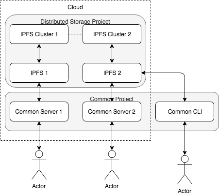

# Common client for distributed AI on blockchain

There are three types of users in our platform. They are: data providers, model providers and execution resource 
providers. This project provides general API services that could be consumed by any of the three types of users. For 
instance, IPFS file upload APIs, data quality management APIs and many more.

We have chosen to use goa design framework. The API designs are in the `./design` folder. Code generation was 
achieved using `go:generate` in `main.go`. CLI is also available. See (https://goa.design/) for details.

## Run as a server using Docker

- (CAUTION) Run `./_clean.sh` to prune all Docker images, containers, networks, volumes.
- Run `./_build.sh` to build the docker image
- Run `./start.sh` to start the sample servers

`start.sh` will firstly start two IPFS nodes (ipfs1 and ipfs2). Then it will wait until all ports are available on 
the two ipfs nodes. Next it will start two cluster nodes (cluster1 and cluster2), and connect the two cluster nodes 
(using raft). Lastly it will run (common1 and common2).

### PORTS
- IPFS1

      - "4001:4001" # ipfs swarm
      - "5001:5001" # expose if needed/wanted
      - "6001:8080" # exposes if needed/wanted
      
- CLUSTER1

      - "9094:9094" # API
      - "9096:9096" # Cluster IPFS Proxy endpoint
      
- COMMON1

      - "3001:3001" # distributed storage server with swagger

- IPFS2

      - "4101:4001" # ipfs swarm
      - "5101:5001" # expose if needed/wanted
      - "6101:8080" # exposes if needed/wanted
      
- CLUSTER2

      - "9194:9094" # API
      - "9196:9096" # Cluster IPFS Proxy endpoint
      
- COMMON2

      - "3101:3001" # distributed storage server with swagger
      
      
### SWAGGER-UI

Friendly swagger-ui is available at `common1:3001/swagger/index.html` and `common2:3101/swagger/index.html`

## Run as CLI
    cd $GOPATH/src/github.com/ZJU-DistributedAI/Common/tool/common-service-apis-cli
    go build
    ./common-service-apis-cli 
    CLI client for the Common service APIs service
    
    Usage:
      Common [command]
    
    Available Commands:
      add         Upload file to IPFS using multipart post
      cat         Cat the file in IPFS at :address
      download    Download file with given path
      help        Help about any command
    
    Flags:
          --dump               Dump HTTP request and response.
      -h, --help               help for Common
      -H, --host string        API hostname (default "localhost:3001")
      -s, --scheme string      Set the requests scheme
      -t, --timeout duration   Set the request timeout (default 20s)
    
    Use "Common [command] --help" for more information about a command.

### Testing CLI by calling endpoints

(CAUTION!) At the moment we do not have our IPFS servers running. Run `./_start.sh` to start IPFS clusters for now.

    ./common-service-apis-cli cat storage /api/v0/storage/QmPZ9gcCEpqKTo6aq61g2nXGUhM4iCL3ewB6LDXZCtioEB
    2018/11/17 11:13:45 [INFO] started id=nOsBsIMf GET=http://localhost:3001/api/v0/storage/QmPZ9gcCEpqKTo6aq61g2nXGUhM4iCL3ewB6LDXZCtioEB
    2018/11/17 11:13:45 [INFO] completed id=nOsBsIMf status=200 time=10.219686ms
    Hello and Welcome to IPFS!
    
    ██╗██████╗ ███████╗███████╗
    ██║██╔══██╗██╔════╝██╔════╝
    ██║██████╔╝█████╗  ███████╗
    ██║██╔═══╝ ██╔══╝  ╚════██║
    ██║██║     ██║     ███████║
    ╚═╝╚═╝     ╚═╝     ╚══════╝
    
    If you're seeing this, you have successfully installed
    IPFS and are now interfacing with the ipfs merkledag!
    
     -------------------------------------------------------
    | Warning:                                              |
    |   This is alpha software. Use at your own discretion! |
    |   Much is missing or lacking polish. There are bugs.  |
    |   Not yet secure. Read the security notes for more.   |
     -------------------------------------------------------
    
    Check out some of the other files in this directory:
    
      ./about
      ./help
      ./quick-start     <-- usage examples
      ./readme          <-- this file
      ./security-notes

## Known issues
* COMMON2 swagger page still calls port 3001, which is the COMMON1 port.